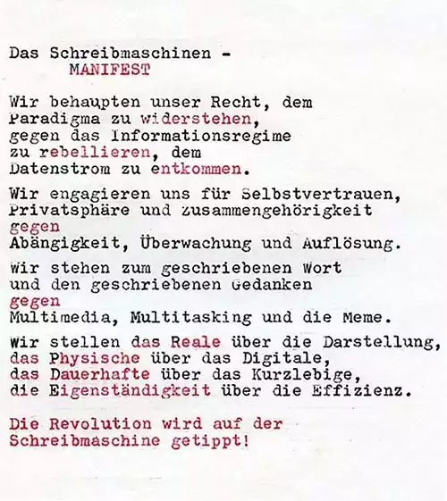

# Einführung

Als Webentwickler und Buchautor beobachte ich mit zunehmender Sorge, wie das Internet mit immer mehr belanglosen und oberflächlichen Inhalten geflutet wird. Das führt zu einer allgemeinen Verflachung des Niveaus und weder User, noch Website-Eigentümer:innen scheinen sich daran zu stören. Statt sorgfältig recherchierte relevante und originelle Inhalte zur Verfügung zu stellen, gab es im letzten Jahrzehnt eine „Pixabayisierung“ des Internets. Manche Pixabay-Bilder hat man schon auf **buchstäblich** hunderten Websites gesehen. „KI“ hebt diese Belanglosigkeit auf eine ganz neue Stufe.

Ich beschäftige mich schon länger mit [Degrowth, Lowtech und (digitaler) Suffizienz](https://weitblick.org/). Ich bin auf der Suche nach Website-Konzepten (aber auch nach Kunden bzw. Anwendungsfällen) für Websites, die schlank und einfach aufgebaut und programmiert sind, nützliche Inhalte bieten und leicht zu warten sind. In letzter Zeit habe ich einige Projekte mit dem statischen Website-Generator [HUGO](https://gohugo.io/) realisiert.

Neulich las ich in der TAZ von Adrian Lobe den Artikel [Künstliche Intelligenz und Vermüllung: KI killt das Web](https://taz.de/Kuenstliche-Intelligenz-und-Vermuellung/!5997952/) der mit diesem Gedanken endete:

> Die KI killt das alte Web, und das neue Web kämpft, geboren zu werden. Nur: Wie und von wem wird dieses Internet gestaltet? Mit welcher Legitimation? Wem gehört es? Welche Such- beziehungsweise Kulturtechniken braucht es,  um Informationen zu finden und zu verifizieren? Wie stellt man  Öffentlichkeit her? (...) Vielleicht  bleibt am Ende die leise Hoffnung, dass sich das alte Web reparieren  lässt und in der Gated Community doch noch das eine oder andere Café eröffnet, wo man kein informationelles Fast Food aufge­tischt bekommt.

Das hat mich dazu angeregt, an alten Überlegungen anzuknüpfen, Websites zu gestalten, die sich radikal auf den Inhalt konzentrieren, aber zugleich auch ästhetisch sind und leicht gepflegt werden können. Neben einer ablenkungsfreien Oberfläche für die Leser:innen ist mir vor allem auch die Alphabetisierung der Website-Betreiber:innen wichtig. Statt sich einem Moloch wie Wordpress, einem Webbaukasten oder einem Socialmedia-Anbieter auszuliefern, bedeutet es Self-Empowerment, den gesamten Prozess von der Formulierung eines Artikels bis zur Veröffentlichung selbst in der Hand zu haben und durchschauen zu können. Ich bin dabei konsequent dem Lowtech-Ansatz gefolgt, um alles so einfach wie möglich zu halten.

## Markdown als Basis

Ich schreibe privat schon seit langem alle Texte in [Markdown](https://de.wikipedia.org/wiki/Markdown) und verwende dazu [Typora](https://typora.io/) als komfortablen Editor. Markdown-Dateien sind reine Textdateien mit einer sehr einfachen, schnell zu erlernende Textauszeichnungssprache. Markdown hat sich als ein Standard etabliert und wird z.B. auch bei statischen Website-Generatoren wie HUGO eingesetzt. Ich habe mich nun gefragt, warum Webbrowser keine Markdown-Dateien direkt anzeigen können? Dann bräuchte man eigentlich nichts weiter und könnte seine Inhalte als miteinander verlinkte Markdown-Dateien auf einen Webserver hochladen und so ganz einfach veröffentlichen.

## „Lowtech“

Um dieser Idee möglichst nahe zu kommen, habe ich eine kleine php-Anwendung programmiert, die nichts weiter macht, als die Markdown-Dateien, die auf den Webserver geladen werden, als HTML-Dateien mit einem gut lesbaren ästhetischen Layout auszuliefern. Die Anwendung ist so einfach programmiert, dass man sie auch mit php-Grundkenntnissen verstehen kann. Wer keine php- und HTML-Kenntnisse hat, braucht nur eine handvoll Dateien auf den Webserver kopieren und anhand einer kleinen Anleitung anpassen und kann sofort loslegen. Die Installation und Konfiguration des „CMS“ ist daher auch für Laien in wenigen Minuten möglich. Es gibt kein großes CMS-Projekt (das oft aus zehntausenden von Dateien besteht), keine regelmäßigen Updates, keine potentiellen Sicherheitslöcher. Einfach nur ein paar hundert Zeilen php-Code und eine CSS-Datei für das Layout.

## Inhaltliche Struktur

Ich habe bewusst auf dynamische Elemente (wie z.B. ein dynamisches Menü oder automatisch generierte Artikellisten) verzichtet, sondern orientiere mich in der inhaltlichen Struktur eher an einem E-Book. Die Website soll eine Titelseite haben, die darüber informiert, worum es geht, ein manuell gepflegtes Inhaltsverzeichnis und evtl. noch eine Seite mit einem Introtext. Diese Elemente (und Impressum und Datenschutzerklärung aus rechtlichen Gründen) sind im Template verlinkt und jederzeit erreichbar. Das Inhaltsverzeichnis übernimmt die Funktion eines Menüs. Wenn es zweckmäßig erscheint, können Seiten auch untereinander (manuell) verlinkt werden – z.B. ein „weiter lesen“-Link am Ende einer Seite.

Für diese einfache Struktur gibt es verschiedene Gründe:

1. Ich möchte die Programmierung des Systems so einfach halten, dass auch Menschen mit Programmier-Grundkenntnissen verstehen können, was passiert und ggf. eigene Anpassungen vornehmen können.
2. Das System ist dadurch leicht zu warten, einfach auf zukünftige php-Versionen anpassbar und sehr sicher. Es ist viel näher an einer statischen als an einer CMS-basierten Website.
3. Das System soll Menschen dabei unterstützen, relevante und sorgfältig erarbeitete Informationen zu publizieren. Dazu gehört dann auch die sinnvolle Verlinkung und Präsentation innerhalb der Website. Automatismen, wie die Timeline in einem Blog oder Verknüpfung via „Tags“ verführen dazu, Texte gedankenlos in die Website „zu kippen“.
4. Dadurch, dass nur jeweils eine Seite direkt 1:1 angezeigt wird, ohne den Rest der Website (technisch) kennen zu müssen, um z.B. ein dynamisches Menü zu erzeugen, ist das Rendering so schnell, dass kein Caching notwendig ist, und der Code maximal einfach bleiben kann (siehe 1.)

## Bilder

Markdown unterstützt das Einbetten von Bildern. Ich verzichte bewusst auf eine dynamische Skalierung der Bilder, wie das heute in CMSen Standard ist. Lowmark ist zur Publizierung von Texten gedacht. Redaktionelle Bilder sollen und müssen selbst skaliert und komprimiert werden. Das gehört für mich zur Alphabetisierung des Users und zu einem bewussten Publizieren von Inhalten dazu. Und es ist eine Bedingung dafür, das System maximal einfach halten zu können (s.o.).

Das System ist so designed, dass die lokalen Markdown-Dateien inkl. der internen Links und eingebetteten Bilder lokal auf dem eigenen PC funktionieren (die Bilder also z.B. auch lokal angezeigt werden) und dann 1:1 ohne Anpassung von Pfaden auf den Webserver kopiert werden können. Die Publizierung von neuen Inhalten ist dann (z.B. per FTP oder rsync) innerhalb von Sekunden möglich.

## Ressourcenschonend

Das Frontend-Layout hat ein sehr geringes Datenvolumen und ist dadurch für nur sehr geringe CO2-Emissionen verantwortlich. Das gilt aber auch für den Rest des Systems. Markdown-Dateien haben kaum Overhead und das Rendern und Ausliefern der Dateien durch diesen Lowtech Website Generator belastet den Webserver um Größenordnungen weniger als ein konventionelles CMS. Auch das spart Energie- und Materialeinsatz im Rechenzentrum und am heimischen PC.

## Inspirationen

Folgende Quellen haben mich zu dem Projekt inspiriert:

* [Typewriterrevolution Manifests](https://typewriterrevolution.com/manifesto.html)
* [Manifesto for a Humane Web](https://humanewebmanifesto.com/)
* [This Page is Designed to Last](https://jeffhuang.com/designed_to_last/)
* [A clean start for the web](https://macwright.com/2020/08/22/clean-starts-for-the-web.html)
* [The Bullshit Web](https://pxlnv.com/blog/bullshit-web/)
* [Project Gemini](https://geminiprotocol.net/)
* [Computing within Limits](https://computingwithinlimits.org/)
* [Why the Office Needs a Typewriter Revolution](https://solar.lowtechmagazine.com/2016/11/why-the-office-needs-a-typewriter-revolution/)
